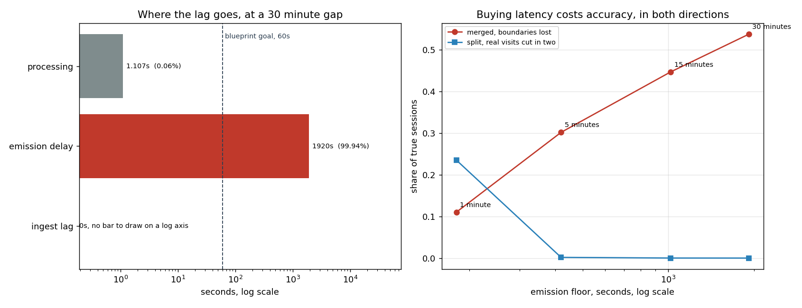

# Streaming Clickstream Lakehouse

Kafka to Spark Structured Streaming to Snowflake, with session windows and exactly-once
writes. Built to handle the parts of streaming that actually break: late events,
duplicates, and reruns.

```bash
./scripts/setup.sh                                        # kafka + minio up, topic created
python -m generator.produce --rate 200 --seconds 5 --report
python -m tests.run_all                                   # 63 checks, no install needed
python -m tests.run_warehouse                             # 9 checks, needs duckdb
python -m tests.run_spark                                 # 33 checks, needs pyspark
python scripts/measure_generator.py                       # every generator number below
```

The generator and `tests/run_all.py` need nothing installed. Standard library only.
`stream/` needs pyspark 3.5 or newer and `warehouse/` needs duckdb. Three suites, each
named for the install it needs. All three are real and all three have to pass. None of
them skips when its dependency is missing.

## Architecture

```
  generator          Kafka                 Spark Structured Streaming            Snowflake
 ┌──────────┐    ┌───────────┐   ┌──────────────────────────────────────┐   ┌──────────────┐
 │ synthetic│───▶│clickstream│──▶│ parse → watermark → dedupe → session │──▶│ sessions     │
 │ events   │    │ .events   │   │ window → feature extraction          │   │ (MERGE)      │
 │ + late   │    │ 6 parts   │   └──────────────────────────────────────┘   └──────────────┘
 │ + dupes  │    │ key=user  │                    │
 └──────────┘    └───────────┘                    ▼
                                            checkpoint dir
                                         (offsets + session state)
```

Key is `user_id` so all of a user's events land on one partition. **The reason written
here until day 4 was that session windows need that to keep state local, and that is
wrong.** Spark reshuffles by the grouping key on its own. The physical plan for
`session_windows` carries `Exchange hashpartitioning(user_id, 8)`, so whatever the
broker did with the key is undone before the aggregation ever sees it. Keying still
buys per-user ordering at the broker and it buys nothing at all for Spark state.

The second half of that sentence was right and is now measured. See below.

## The generator

`generator/` builds the traffic. Every knob exists because day 3 has to survive it.

| Module | What it owns |
|---|---|
| `clock.py` | Wall time or simulated time. A thirty minute session gap in 1.8 seconds. |
| `population.py` | Who exists, and a Zipf weight so a few users take most of the traffic. |
| `arrivals.py` | Who is on the site right now. Visits start, run for a budget, and end. |
| `session.py` | The funnel, the referrer chain, and the ground truth session boundary. |
| `events.py` | Assembles the record. |
| `produce.py` | Rate control, late-event injection, duplicate emission. |
| `sinks.py` | jsonl, stdout, memory, null, and an untested Kafka path. |

`stream/` reads it back.

| Module | What it owns |
|---|---|
| `schema.py` | The declared wire schema and the one place a timestamp is built. |
| `sessionize.py` | parse, watermark, dedupe, session windows, and the door they compose into. |
| `job.py` | Source, sink, and the query progress numbers pulled off the running query. |
| `features.py` | The four per-session features and why duration is not the window span. |
| `scoring.py` | The comparison against `session_hint`. Nothing in the pipeline imports it. |

`warehouse/` lands them.

| Module | What it owns |
|---|---|
| `sql.py` | Every statement in both dialects, and which of them have ever run. |
| `merge.py` | Stage, merge, clear. The only function that writes to `sessions`. |

## Measured on 2026-08-14

Every figure here comes out of `scripts/measure_generator.py` on this machine on that
date. Re-run it and they move. Sandbox speed varies by about 1.8x between days, so
treat the ratios as the durable part.

**Throughput ceiling.** 37,226 events per wall second with the pacer switched off,
median of five passes after a discarded warmup, range 37,012 to 37,327.

**Rate control.** Ask for 50, 500 or 5,000 events per second and the run comes back
1.10, 0.21 and 0.11 percent high. The error shrinks as the rate rises, because the
overshoot is a fixed per-sleep cost divided by more events.

**Partition skew at six partitions.** Heavier tail, busier partition.

| alpha | share of traffic taken by the top 50 users | busiest partition over even | quietest |
|---|---|---|---|
| 0.0 | 1.0% | 1.071 | 0.949 |
| 0.6 | 13.7% | 1.129 | 0.893 |
| 1.0 | 49.5% | 1.274 | 0.804 |
| 1.4 | 85.5% | 1.212 | 0.786 |

The 1.4 row is lower than the 1.0 row and that is not noise. At alpha 1.4 the visit
pool cannot keep 150 distinct people on the site, so the busiest users spend their
draws extending a visit they are already in rather than starting new ones. The
generator reports that as `admissions_deflected` rather than hiding it.

**Lateness.** At an 8 percent injection rate the realised share is 7.88 percent over
121,123 events. Median 12.07 seconds. p95 118 seconds and p99 297 seconds. The longest was
2,494 seconds. 12.3 percent of late events are more than a minute behind.

This block used to end with a sentence saying a one minute watermark would therefore
drop about 1 percent of the stream. Day 3 measured it and dropped zero. The sentence
was a prediction written in the voice of a measurement and it is corrected below.

**Session shape.** 900,000 events, 105,730 sessions, 2,000 users. Median 5 events per
session and p95 26. A single event is 11.3 percent of them and 32.7 percent
contain a checkout.

## The thing day 2 got wrong

The first build of the generator sampled a user from the whole population on every
event. It looked fine. Then the measurement said 2,000 users and 2,000 sessions, a
median of 110 events each, and a conversion rate of 100 percent.

Nobody ever left. With 2,000 users and 500 events per second, every user gets an event
every four seconds forever, so no inactivity gap ever reaches thirty minutes and no
session ever ends. The ground truth column the whole project scores against was one
session per user.

`arrivals.py` is the fix. A visit holds a user for a budgeted number of events and then
releases them, so a session ends because the visit ended and not because the clock ran
out.

## The number day 3 has to live with

The pipeline recovers sessions from a thirty minute inactivity gap. The generator knows
where the real boundary was. They disagree, and the disagreement is not small.

| users | alpha | uniform prediction for the return gap | sessions | boundaries the gap rule misses |
|---|---|---|---|---|
| 2,000 | 1.0 | 24 s | 35,279 | 94.4% |
| 20,000 | 1.0 | 240 s | 35,434 | 72.4% |
| 100,000 | 1.0 | 1,200 s | 35,347 | 57.9% |
| 300,000 | 1.0 | 3,600 s | 35,511 | 50.7% |
| 300,000 | 0.0 | 3,600 s | 35,664 | **5.6%** |

The obvious prediction is that a visitor returns after `users * visit_events / rate`
seconds. That column is in the table because it is wrong. At 300,000 users it predicts
a return gap of an hour, twice the threshold, and half the boundaries still vanish.

The last row is the control. Same population and same rate, with flat weights in
place of the Zipf tail. The miss rate falls from 50.7 percent to 5.6 percent. The cause is the
tail and not the population size. Most visits belong to the busiest few users, and
those people come back in seconds however many other users exist.

So a session count off this pipeline is a lower bound, and how much of a lower bound
depends on the shape of the user distribution rather than on anything the streaming job
does. Day 3 measures it against `session_hint` rather than assuming it away.

## The streaming job

`stream/` is the pipeline. Four steps, and the order of them is not free.

```bash
pip install -r requirements.txt
python -m generator.produce --rate 8 --seconds 7200 --speedup 500000 \
    --sink file --out /tmp/all.jsonl
mkdir -p /tmp/events && (cd /tmp/events && split -n l/12 -d --additional-suffix=.json /tmp/all.jsonl shard-)
python -m scripts.flush_shard --dir /tmp/events --hours 6
python -m stream.job --source file --path /tmp/events --out /tmp/sessions \
    --checkpoint /tmp/ckpt --available-now --files-per-trigger 1 --progress
python -m scripts.score_sessions --events /tmp/events --sessions /tmp/sessions --features
python -m stream.job --source file --path /tmp/events --sink duckdb --duckdb /tmp/wh.duckdb \
    --checkpoint /tmp/ckpt2 --available-now --files-per-trigger 1 --progress
python -m tests.run_spark
python -m tests.run_warehouse
```

`build_sessions` in `stream/sessionize.py` is the only route from a payload to a
session. The job, the scorer and the tests all call it, so none of them can drift
into testing a pipeline that is not the one that runs.

**Why the watermark is set before the dedupe.** `dropDuplicates(["event_id"])` is
what most examples use and it keeps every event_id it has ever seen. event_id is not
the watermark column, so Spark has nothing to expire the entry against and the state
grows for as long as the stream runs. `dropDuplicatesWithinWatermark` bounds that
state on the watermark instead. Worth being honest about what this corpus proves.
The generator's duplicate carries the original `event_ts` and only re-stamps
`ingest_ts`, so all three available dedupe forms catch it. The case that separates
them is a retry whose event time moved, and that shape is not in the data.

### The watermark is not what admits late data

The obvious expectation is that a two minute watermark against a lateness tail
reaching seventeen minutes throws away a lot of events. It throws away none.

Measured on 2026-08-15 over 58,182 events in 12 shards, one shard per trigger, on
Spark 3.5.6 and Java 11. `dropped` is `numRowsDroppedByWatermark` read off the query
progress rather than counted by hand.

| watermark | session gap | dropped by session window | dropped by dedupe | sessions out | events covered |
|---|---|---|---|---|---|
| 10 seconds | 30 minutes | 0 | 2 | 3,252 | 57,598 |
| 2 minutes | 30 minutes | 0 | 0 | 3,252 | 57,600 |
| 30 minutes | 30 minutes | 0 | 0 | 3,252 | 57,600 |
| 10 seconds | 2 minutes | 0 | 2 | 5,850 | 57,598 |
| 2 minutes | 2 minutes | 0 | 0 | 5,852 | 57,600 |

The corpus holds 58,181 rows carrying 57,600 distinct `event_id`, so 581 are the
duplicates the generator emitted on purpose. Every row where nothing was dropped
covers exactly 57,600 events. The dedupe removed all 581 copies and lost nothing. The
two rows at a 10 second watermark cover 57,598, which is the 2 the dedupe reported
refusing. Both sides of that reconcile to the unit and neither is a spot check.

The last row is worth a second look. Same 2 minute gap as the row above it and 5,852
sessions against 5,850. A wider watermark holds state longer, so two sessions that the
narrower setting closed and never reopened stayed open long enough to absorb a later
event. That is the watermark changing the answer without dropping anything.

A plain count of rows sitting below the watermark at the start of their batch says
98 rows at a 10 second watermark and 25 at 2 minutes. That calculation is in the
day 3 audit and it runs in Python with no Spark in it. Spark dropped 2.

The reason is the session gap. A session window ends one gap after its last event,
so a late event is only refused when even the new session it would open has already
closed. Add the gap to each row's event time and the same independent calculation
predicts **zero** at a 30 minute gap, which is what Spark did at all three watermark
settings. At a 2 minute gap it predicts 23 and Spark still dropped 0, with and
without the dedupe operator in front, so the gap aware model is an upper bound and
not the whole rule. What loosens it further was not chased and is written down
rather than guessed at.

The practical version. On a session windowed pipeline the watermark is buying output
latency and state size, not late data. The gap is doing the admission. Tuning the
watermark to protect against data loss is tuning the wrong number.

**That claim is about the session window operator and day 4 found a hole beside it.**
The dedupe operator is reported as its own column above for exactly this reason. On
day 3 it refused 0 rows at a 2 minute watermark against an independent Python count
of 25 sitting below it. On day 4, on a different corpus, it refused 98 against an
independent count of 124. The session window operator dropped 0 on both days, so the
finding above is untouched. Turning 0 of 25 into 98 of 124 needs a mechanism and I do
not have one. It is being chased rather than smoothed over.

### Scoring against ground truth

`session_hint` is the real boundary and the pipeline never reads it.
`stream/scoring.py` joins the raw events back onto the emitted windows, so what gets
graded is the pipeline's actual output and not a variant carrying a truth column.

| corpus | max lateness | gap rule misses, per the generator | boundaries lost, per Spark | splits | events dropped |
|---|---|---|---|---|---|
| seed 7 | 1,040 s | 3,770 | 3,770 | 0 | 0 |
| seed 11 | 2,035 s | 3,721 | 3,723 | 0 | 1 |
| seed 7, fat tail | 80,211 s | 3,691 | 3,770 | 142 | 885 |

Row one is the day 2 prediction reproduced against the real Spark job, exactly, on
7,022 true sessions against 3,252 recovered. Boundary miss rate 0.5369.

Rows two and three are the check on whether that exactness means anything. It is
conditional. The generator's rule walks events in arrival order and tracks the
newest event time it has seen. Spark sorts by event time and does not care about
arrival order. Those two can only disagree when a late event lands inside a gap
wider than the threshold, which needs lateness above the gap. At 1,040 seconds
against an 1,800 second gap that is arithmetically impossible and the two agree to
the unit. At 2,035 seconds two events manage it. At 80,211 seconds the answers come
apart by 79 boundaries, 142 true sessions get split and 885 events are refused
outright.

Spark returning 3,770 on rows one and three is a coincidence of the shared seed
rather than a pattern. Row two, on a different seed, returns 3,723.

## The partitioner, finally measured against a broker

`generator/population.py` has claimed since day 1 that `crc32_partition` reproduces
librdkafka's default partitioner. Nothing had checked it. Day 4 stood a real broker
up and checked it, and checked the Java claim beside it.

Kafka 3.7.1 in KRaft mode on one node with six partitions. librdkafka 2.15.0. The
keys are 200 distinct user ids from `generator.population.Population` and the same
200 go through both clients into two topics. Measured 2026-08-16 by
`scripts/probe_partitioner.py`.

| producer | model | keys | disagreements |
|---|---|---|---|
| librdkafka | `crc32_partition` | 200 | 0 |
| librdkafka | `murmur2_partition` | 200 | 169 |
| Java console producer | `murmur2_partition` | 200 | 0 |
| Java console producer | `crc32_partition` | 200 | 169 |

Both models are exact for their own client and wrong for the other on 169 of 200
keys. That is 84.5 percent against the 83.3 percent two unrelated hashes would
disagree by chance over six partitions, so the two hashes carry no shared structure
worth naming.

The consequence is narrow and it is real. Two producers written in different
languages, pointed at the same topic with the same key, do not co-locate a user.
Anything downstream that assumes per-key locality across both is assuming something
the broker never promised. For this project the answer turned out to be that Spark
did not need the locality anyway, which is the correction at the top of this file.

The Java side is driven by `kafka-console-producer.sh` rather than by a Java
partitioner written here. A port measured against another port measures nothing.

## Session features

Day 4's four features, computed inside the session window in `stream/features.py`.

**`duration_s` is the span of real events, not the span of the window.** A session
window ends one gap after its last event, so `session_end - session_start` carries
the entire gap on every row. Measured over the 2,366 recovered sessions of the
2026-08-16 corpus, median `duration_s` is 10.1 s against a median `window_span_s` of
1,810.1 s. That is a factor of 133.7 at the median. The mean difference is exactly
1,800.0 s, which is the gap. Both columns ship so the inflation is visible in the
data rather than only in a comment.

**`page_depth` is a `collect_set` and not a `countDistinct`.** Spark refuses a
distinct aggregate on a streaming DataFrame outright with "Distinct aggregations are
not supported on streaming DataFrames/Datasets", and its error suggests
`approx_count_distinct`. That suggestion is wrong here. Page depth runs from 1 to
about 100 in this corpus and an exact answer is available, so a sketch would be an
estimate bought for nothing. The cost of `collect_set` is one set of page strings held
per open session.

### What the boundary miss rate does to the features

Day 3 measured the thirty minute gap losing boundaries and left it as a number about
sessionization. This is the same number seen from the dashboard end. Measured
2026-08-16 over 58,157 events. 6,664 true sessions against 2,366 recovered, so the
boundary miss rate is 0.645.

| feature | per true visit | per recovered session | ratio |
|---|---|---|---|
| conversion rate | 0.3262 | 0.4463 | 1.368 |
| bounce rate | 0.1172 | 0.0845 | 0.721 |
| events per session | 8.64 | 24.30 | 2.812 |
| pages per session | 4.95 | 9.74 | 1.968 |
| duration, seconds | 16.51 | 67.06 | 4.061 |

Every feature is computed correctly and every one is wrong, because a merged session
inherits the union of two visits. A checkout anywhere in the pair marks the whole
thing, so conversion goes up. A bounce in either half stops being a bounce, so bounce
goes down. The levels here are properties of `generator/session.py` and only the
ratios say anything about the pipeline.

`stream/scoring.py` computes both sides and `tests/test_scoring.py` checks it against
a two visit fixture whose answer is known by hand.

## The latency floor, measured on 2026-08-17

The goal line at the top of this project's brief asks for under a minute of end to end
lag. The design the same brief specifies cannot reach it, and the gap is not close.
This section is that arithmetic and its check against the pipeline's real output.

**First, what is not measured here.** The corpus is a replay. Every event carries a
timestamp the generator chose and the job reads the files minutes after they were
written, so `now() - event_ts` is the age of the corpus. Publishing it as a p95 would
be reporting how long ago the generator ran in the voice of a service level objective.
No number below is a wall clock event to query lag, because this repo has no live
producer to measure one against.

**What is measured is the lag the design imposes.** Three terms. Rebuild the corpus
with the commands in "The streaming job" above, then:

```bash
python -m stream.job --source file --path /tmp/events --out /tmp/sessions \
    --checkpoint /tmp/ckpt --available-now --files-per-trigger 1 \
    --progress-json /tmp/progress.json
python -m scripts.latency_report --events /tmp/events --sessions /tmp/sessions \
    --progress /tmp/progress.json
```

| term | p50 | p95 | p99 | where it comes from |
|---|---|---|---|---|
| ingest lag, seconds | 0.0 | 3.0 | 37.391 | `event_ts` to `ingest_ts` over the files |
| emission delay, seconds | 1,920 | 1,920 | 1,920 | `gap + watermark`, a constant |
| batch processing, ms | 1,107.5 | 2,435.9 | 3,828.0 | `addBatch` off the query progress |

The emission delay is 99.94 percent of the total and it is the one term nobody calls
latency. A session window ends one gap after its last event. Append mode emits a
window once the watermark has passed its end, and the watermark trails the newest
event time by the delay. So nothing can come out until the stream's clock has moved
`gap + watermark` past the session's last event. At the defaults that is 1,800 plus
120, which is **1,920 seconds against a 60 second goal, over by 32.02x**.

That is not a tuning problem and no amount of hardware touches it. Processing is 1.1 s
at the median and the whole budget is 1,921.1 s.

**The floor is checked against the emitted data rather than left as algebra.**
`session_end - session_start - duration_s` should equal the gap on every row, and over
the 3,252 sessions of this run the minimum and the maximum are both exactly 1,800.0 s.
Worth being clear about what that proves. Session end is *defined* as last event plus
gap, so this confirms the code implements the definition. It is not independent
evidence about Spark.

**The median event waits longer than the floor.** Emission lag per event is p50
2,548.75 s, p95 7,891.5 s and p99 8,767.7 s, against a floor of 1,920. The excess is
session duration, because the first event of a session waits the whole session out on
top of the structural delay. Session durations are p50 151.0 s and p95 4,619.6 s over
the same run, and a long session holds more events, so the event weighted median sits
well above the session median.

**A cross check that the ingest term is reading real data.** 3,562 of 58,181 rows
carry a nonzero lateness. The generator reports injecting 2,981 late events and
emitting 581 duplicates, and a duplicate is re-stamped with a later `ingest_ts` by
design. 2,981 plus 581 is 3,562, to the row.

### Buying latency costs accuracy in both directions

The session gap is the only knob that moves the floor, and it moves boundary accuracy
at the same time. `scripts/latency_sweep.py` runs the whole pipeline at each setting
and scores the output against `session_hint`. Watermark held at 2 minutes throughout.
58,182 input rows and 7,022 true sessions, one shard per trigger.

| session gap | emission floor, s | sessions out | merged, boundaries lost | split | events dropped |
|---|---|---|---|---|---|
| 1 minute | 180 | 8,443 | 0.1102 | 0.2348 | 0 |
| 5 minutes | 420 | 4,917 | 0.3015 | 0.0017 | 0 |
| 15 minutes | 1,020 | 3,888 | 0.4465 | 0.0001 | 0 |
| 30 minutes | 1,920 | 3,252 | 0.5369 | 0.0000 | 0 |

The 30 minute row reproduces day 3's published figures exactly, on a different day and
a later tree. 3,252 sessions, miss rate 0.5369, no splits.

**The thirty minute default is worse on latency and worse on merges.** It is 10.7x
slower than a one minute gap and loses 4.9x more boundaries. The single thing it buys
is never cutting a real visit in two. That is a real frontier and not a free lunch, so
there is no dominant setting. Which end to pick depends on whether an over-counted
session costs more than an under-counted one, and that is an application question
rather than a Spark question. What is not defensible is picking 30 minutes because it
is what the tutorials say.



Neither panel is drawn by anything that computes. `scripts/latency_dashboard.py` reads
the two JSON files and draws. The ingest bar is absent rather than shown at 1 ms,
because its p50 really is zero and a log axis has nowhere to put that.

### The dedupe drop count was a data difference, not a code change

Day 4 opened `ot-039`. `dropDuplicatesWithinWatermark` refused 0 rows on day 3 and 98
on day 4, and turning 0 into 98 needed an explanation that neither day had.

Day 3's corpus was rebuilt from its recorded command and run through today's tree.
It read 58,182 input rows, matching day 3 to the row. The dedupe refused **0**, which
is day 3's answer exactly. So nothing in the day 4 or day 5 diff moved the dedupe
operator. It is sensitive to the corpus and not to the code.

The rest of that thread does not close, and the reason is worth stating. **Day 4's
corpus cannot be rebuilt, because the command that produced it was never written
down.** A corpus built to day 4's described settings gives 58,167 rows against day 4's
58,158 and an independent late count of 38 against 124, so it is a similar corpus and
not that corpus. The dedupe refused 2 on it. The figure "98 against 124" therefore
rests on an input nobody can reconstruct, including a later run of this project, and
it is marked as such above rather than repeated as though it were checkable. Every
command that builds a corpus quoted here is now in this README.

## The warehouse sink

Stage, merge, clear. A batch lands in `sessions_stage`. One MERGE moves it into
`sessions` keyed on `(user_id, session_start)` and then the stage is emptied. That is the
shape a Snowflake load takes with a staged file in front of it, so the DuckDB path is
a rehearsal of the real one rather than a different design.

**Snowflake has never been contacted.** `warehouse/sql.py` holds every statement in
both dialects and says which have run. DuckDB 1.5.5, all of them, on 2026-08-16.
Snowflake, none, ever.

Idempotency is a claim, so it is measured. The job ran the whole corpus into a fresh
database, then ran it again from a fresh checkpoint into the same database.

```
run 1  batch_rows 2366  rows_before 0     rows_after 2366  inserted 2366  updated 0
run 2  batch_rows 2366  rows_before 2366  rows_after 2366  inserted 0     updated 2366
fingerprint before replay  2366:4e4929dbea89f6ce98368a25d9eff67d
fingerprint after  replay  2366:4e4929dbea89f6ce98368a25d9eff67d
```

The fingerprint is an md5 over every column except `loaded_at`, ordered by the merge
key, so a merge that dropped one row and inserted another would not survive it. A row
count on its own would.

**Matched rows are updated, not skipped.** `DO NOTHING` would look idempotent and
would pin the first version of a session forever, including a truncated one written
before a replay finished it.

**A batch holding two rows for one key is refused before the MERGE is sent.**
DuckDB refuses it too, which `tests/test_merge.py` checks rather than assumes, so the
guard is a better error message and not the only thing standing between a replay and
an arbitrary winner. No batch in the 2026-08-16 run contained one.

## Failure and replay, measured 2026-08-18

Day 6 is the day the exactly-once claim gets attacked. `stream/job.py` takes
`--crash-batch` and `--crash-point`, which kill the job at a chosen batch either side
of the MERGE. `scripts/replay_matrix.py` drives five arms and compares each final
table against the clean one. `stream/recovery.py` reads the checkpoint and says which
batch a restart is going to redo.

Corpus for all five arms: 17,441 rows in 8 shards plus one flush sentinel, one shard
per trigger, 10 batches.

```bash
python -m generator.produce --rate 0.8 --seconds 21600 --speedup 500000 --seed 6 \
    --users 4000 --alpha 1.2 --partitions 6 --sink file --out /tmp/all6.jsonl
mkdir -p /tmp/c6 && (cd /tmp/c6 && split -n l/8 -d --additional-suffix=.json /tmp/all6.jsonl shard-)
python -m scripts.flush_shard --dir /tmp/c6 --hours 6
python -m scripts.replay_matrix --arm clean --corpus /tmp/c6 --work /tmp/rm
```

| arm | what happened | rows at the crash | final rows | verdict |
|---|---|---|---|---|
| clean | no crash | | 1,626 | baseline |
| crash-after | died after batch 4 merged | 793 | 1,626 | identical |
| crash-before | died before batch 4 merged | 429 | 1,626 | identical |
| fresh-checkpoint | checkpoint deleted, same warehouse | | 1,626 | identical |
| wiped-warehouse | checkpoint kept, warehouse deleted | | 0 | **rows lost** |

Duplicate merge keys in every arm: 0. Both crash arms left exactly one batch planned
and uncommitted, batch 4, and the restart redid batch 4 and then added 5 through 9.

**The checkpoint contributes nothing to the correctness of this table.** Delete it and
rerun everything from the start and the fingerprint is byte for byte the one the clean
run produced. What makes the replay safe is the merge key, and that is a property of
`warehouse/sql.py` rather than of Structured Streaming.

**The checkpoint can still lose the whole table on its own.** Keep it and lose the
warehouse. The job reads its own commit log, concludes there is nothing left to do,
and finishes clean with an empty target. No error and no warning. Exactly-once is a
joint property of two pieces of state that live in different systems, and nothing
checks that they still agree.

That asymmetry is the useful part. The checkpoint is a progress optimisation that
carries a correctness liability, and the usual framing has it the other way round.

## Kafka, end to end, 2026-08-18

`generator/sinks.py` had a `KafkaSink` from day 2 that had never been run, and
`build_sink` raised `NotImplementedError` rather than returning it. Day 6 ran it
against a real broker, so the guard came off.

Broker: Kafka 3.7.1 in KRaft mode, 6 partitions, listeners pinned to `127.0.0.1`.

```
generator.produce --sink kafka   5,446 events, 0 delivery failures
sentinel                         1 event
stream.job --source kafka        2 batches, 5,447 input rows, 708 sessions landed
checkpoint offsets at batch 1    p0 1049  p1 833  p2 682  p3 870  p4 1098  p5 915
```

Those six offsets sum to 5,447, which is what the producer sent. That is the check
worth having, because it is the only one that ties the broker's own bookkeeping to
the row count the job reports.

Two batches rather than ten, because there is no `maxOffsetsPerTrigger` here. The
per batch behaviour in the replay table above is a property of `maxFilesPerTrigger`
on the file source, not of the pipeline.

The Kafka connector is not in the base pyspark install. Add it with
`--packages org.apache.spark:spark-sql-kafka-0-10_2.12:3.5.6`, or point
`PYSPARK_SUBMIT_ARGS` at downloaded jars, which is what this run did.

## Status

Day 6 of 7.

- [x] Day 1: compose stack, event schema, decisions doc
- [x] Day 2: producer with rate control. Late events, duplicates and a visit model
- [x] Day 3: streaming job. parse / dedupe / watermark / sessionize
- [x] Day 4: feature extraction, staged MERGE sink, partitioner probe
- [x] Day 5: latency and throughput metrics, the gap tradeoff sweep
- [x] Day 6: failure testing and replay. Duplicate verification and Kafka end to end
- [ ] Day 7: benchmarks and writeup

## Limitations, today

- **The Kafka path has run exactly once. One broker and one corpus.** Day 6 produced
  5,446 events through `KafkaSink` and read them back through `--source kafka`, and
  the checkpoint offsets sum to the produced count. Everything measured about
  watermarks, gaps and replay still came off the file source, because a broker will
  not fit alongside a five arm matrix in this sandbox. One clean end to end run is not
  the same as the numbers having been taken there.
- **The crash arms were never restarted against Kafka.** The replay matrix runs on the
  file source, whose offset is a log ordinal. A Kafka restart resumes from a committed
  partition offset instead, and the failure modes around a rebalancing consumer group
  are not exercised by anything here.
- **`wiped-warehouse` is a measured failure and not a fixed one.** Nothing in this
  repo detects that the checkpoint and the warehouse have drifted apart. The obvious
  guard is to record the last committed batch id in the warehouse inside the same
  transaction as the merge, and compare the two at startup. That was not built today,
  because a batch id column changes the table every number since day 4 rests on.
- **The warehouse is DuckDB and the Snowflake statements have never run.** They are
  written beside the ones that did and labelled, in `warehouse/sql.py`. Snowflake also
  accepts a PRIMARY KEY declaration without enforcing it, so on that side the
  uniqueness of `sessions` rests entirely on the MERGE.
- **The sink collects each micro batch to the driver.** One DuckDB file cannot be
  written by several executors. At session volume that is fine and it is not how the
  Snowflake version would work.
- **`page_depth` and `duration_s` are honest measurements of dishonest sessions.**
  The features are computed correctly and the boundary miss rate of 0.645 makes every
  one of them wrong at the levels shown above. Fixing that is a sessionization
  problem, not a feature problem.
- **A bounded run leaves sessions in state.** Append mode emits a window once the
  watermark passes its end, and a run that stops reading files never advances the
  watermark again. The first full run emitted 2,117 sessions and left 34,481 events
  sitting in state. `scripts/flush_shard.py` is a harness step that pushes one
  sentinel event days into the future to close them. A real stream does not need it.
  Any number here that came from a flushed run is a number about a bounded rerun.
- **The gap aware model of late data admission is an upper bound.** It predicts the
  30 minute gap result exactly and over-predicts at a 2 minute gap. Something further
  loosens the filter and it has not been identified.
- **No wall clock latency has been measured and none can be here.** Every lag figure
  above is the delay the design imposes, computed from the pipeline's own output. A
  real number needs a live producer and a query running against the warehouse at the
  same time. Day 6 had a live producer and did not build it, because the corpus is
  still a replay of historical timestamps and the answer would be the age of the
  events rather than the latency of the system.
- **The day 4 dedupe figure rests on a corpus that cannot be rebuilt.** 98 refusals
  against an independent count of 124 came off an input whose generator command was
  never recorded. The claim it supports is narrow and it is not checkable. Day 3's
  corpus is rebuildable and reproduces exactly.
- **`scripts/watermark_sweep.py` raised AttributeError for a day and nothing noticed.**
  Day 4 added `--sink` to the job and the hand built namespace in that script was not
  updated, so every run of the script that produces the watermark table died on the
  first arm. Fixed, and `tests/test_structural.py` now compares every hand built
  namespace against the attributes `stream.job.run` really reads. Nothing in the suite
  executes a script, so that class of break needs a check that reads source.
- **The lag budget adds three p50 values as if they composed.** The median of a sum is
  not the sum of medians. At these magnitudes the conclusion does not depend on it,
  since one term is 99.94 percent of the total, and on a corpus where the terms were
  comparable this arithmetic would need replacing with a real convolution.
- **The visit pool holds one state per user seen** and never evicts. At a few million
  users that is a memory problem.
- **A duplicate is always a whole-record copy.** A real retry storm also produces
  partial and reordered writes, and none of that is modelled.
- **The event mix is hand chosen.** The funnel probabilities came from what looks
  plausible, not from a real site. Any conclusion about conversion rates is a
  conclusion about `session.py`.
- **`admissions_deflected` changes the visit length distribution** when it fires, and
  the report says how often rather than correcting for it.

Design decisions and open questions are in `docs/decisions.md`.
